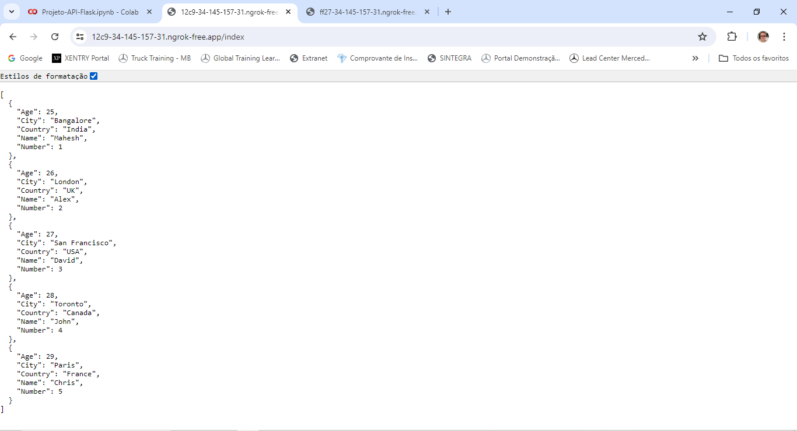

# Criando-uma-API-com-Flask-no-Ambiente-COLAB

- Curso: Python Development
- Módulo: Criando-uma-API-com-Flask-no-Ambiente-COLAB
- Instrutor: Diego Bruno
- Instituição: [DIO.me](https://www.dio.me/)
- Editor de Código: Google Colab

Neste projeto utilizei o Google Colab para desenvolver uma API utilizando os frameworks Flask e FastAPI.

## Desafio

__1ª Parte:__
O Objetivo da primeira parte e fazer leitura de uma planilha de dados no formato JSON utilizando uma API no ambiente de desenvolvimento colaborativo COLAB. Para isso dever ser usado o framework Flask, gerando uma URL que apresenta uma lista com o conteúdo com dados da tabela passada no desafio. Na imagem 1 abaixo podemos vero resultado da URL aberta.

 Imagem 1

__2ª Parte:__