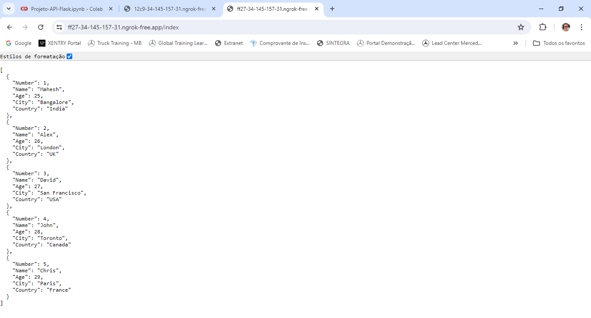

# Criando-uma-API-com-Flask-no-Ambiente-COLAB

- Curso: Python Development
- Módulo: Criando-uma-API-com-Flask-no-Ambiente-COLAB
- Instrutor: Diego Bruno
- Instituição: [DIO.me](https://www.dio.me/)
- Editor de Código: Google Colab

Neste projeto utilizei o Google Colab para desenvolver uma API utilizando os frameworks Flask e FastAPI.
O arquivo "Projeto_API_Flask.ipynb" está presente nos arquivos do projeto, mostrando a lógica empregada para resolver este desafio.

## Criando Repositório

Primeiramente criei o repositório no __GitHub__ com nome __"Criando-uma-API-com-Flask-no-Ambiente-COLAB"__ e clonei o repositório para meu PC utilizando o __GitHub Desktop__.

## Desafio

__1ª Parte:__
O Objetivo da primeira parte é fazer leitura de uma planilha de dados no formato JSON utilizando uma API no ambiente de desenvolvimento colaborativo COLAB. Para isso dever ser usado o framework Flask, gerando uma URL que apresenta uma lista com o conteúdo com dados da tabela passada no desafio. Na __imagem 1__ abaixo podemos ver o resultado da URL aberta.

 Imagem 1

__2ª Parte:__
Já o objetivo da segunda parte é fazer leitura de uma planilha de dados no formato JSON utilizando uma API no ambiente de desenvolvimento colaborativo COLAB. Para isso dever ser usado o framework FastAPI, gerando uma URL que apresenta uma lista com o conteúdo com dados da tabela passada no desafio. Na __imagem 2__ abaixo podemos ver o resultado da URL aberta.

 Imagem 2

## Conclusão

Este foi mais um projeto de __Liguagem Python__ dentro do curso __Python Development__ e foi a primeira vez que tive contato com o Google Colab. Achei a ferramenta fácil de usar. Também foi meu primeiro contato com os frameworks Flask e FastAPI, tendo minha primeira experiência com desenvolvimento web.
Grande abraço a todos!!!

## Linguagens de Marcação e Programação

- 

- 

## Ferramentas e Serviços

- 

- 

- 

- https://img.shields.io/badge/Colab-F9AB00?style=for-the-badge&logo=googlecolab&color=525252